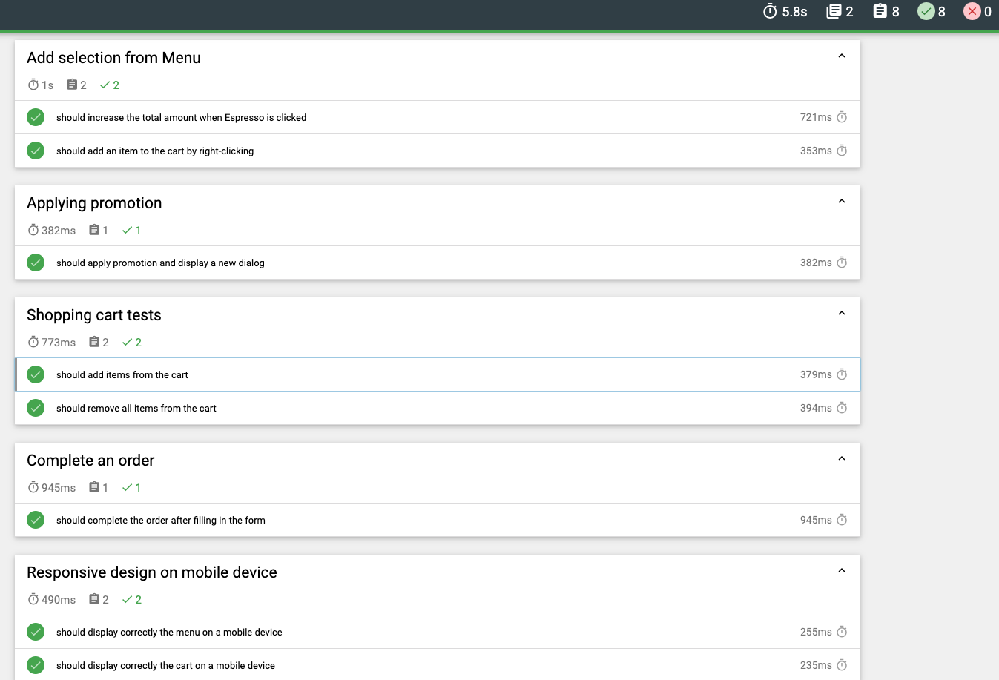

# Cypress Web UI Testing Project

This project contains end-to-end tests for [\[Coffee cart app\].](https://coffee-cart.app/)

## Getting Started

These instructions will get you a copy of the project up and running on your local machine for development and testing purposes.

### Prerequisites

Before running the tests, ensure you have the following installed:

- Node.js and npm

### Installing

1. Clone the repository to your local machine

2. Navigate to the project directory

3. Install dependencies:

```
npm install
```

### Running the Tests

To open the Cypress Test Runner, run:

```
npx cypress open
```

To run Cypress tests headlessly in the terminal, run:

```
npx cypress run
```

### Test Structure

The tests are organized under the `cypress/e2e` directory. You can add or modify test files there.

### Configuration

You can configure Cypress options in the `cypress.config.js` file. For example, you can set the base URL for your tests.

### Customization

You can extend Cypress functionality by adding custom commands and plugins. Custom commands can be added to the `cypress/support/commands.js` file, and plugins can be configured in the `cypress/plugins/index.js` file.

### CI/CD Integration

We have integrated the test execution in GHA. At the moment the tests will run on every push to the repository or whenever we open a pull request. More info at `.github/workflows/cypress.yaml`

You can download the test report from the artifact section.

